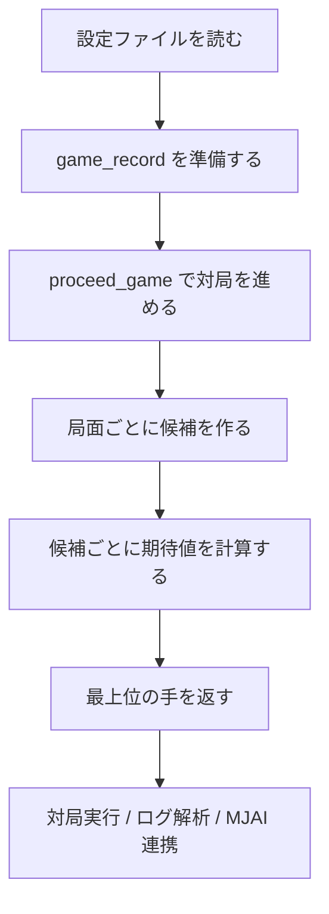
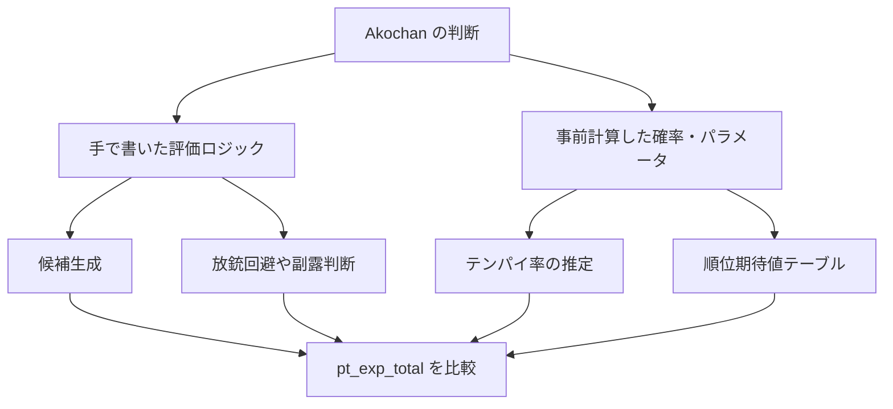
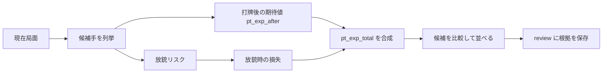
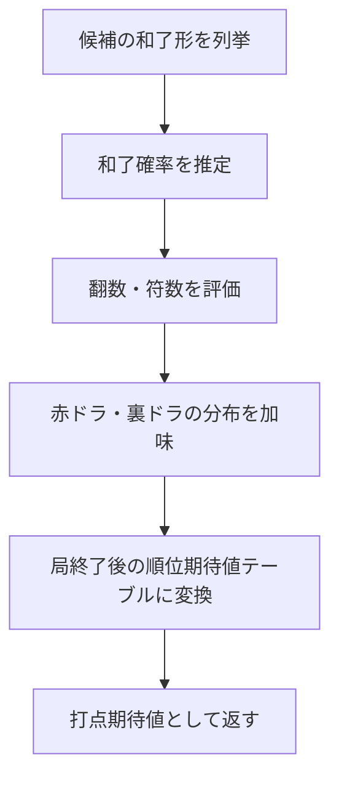

# Akochan の仕組み

このドキュメントは、Akochan が内部でどのように動いているかを、実装の流れに沿ってまとめたものです。

## まず全体像

Akochan は、麻雀の対局記録を1手ずつ進めながら、各局面で合法手を列挙し、その中から期待値の高い行動を選ぶ AI システムです。



大まかな流れは次の通りです。

1. `setup_match.json` や `setup_mjai.json` から対局条件と戦術設定を読む
2. 現在の局面を `game_record` として保持する
3. 進行関数が次の手番まで対局を進める
4. 進行結果を元に、AI が候補手を評価する
5. 使い方に応じて、対局実行、ログ解析、MJAI 連携、統計出力を行う

## 中心になるデータ

Akochan の内部では、対局の履歴を JSON の列として扱います。これをここでは `game_record` と呼びます。

`game_record` には、次のような情報が順番に入ります。

- `start_game`
- `start_kyoku`
- `tsumo`
- `dahai`
- `chi` / `pon` / `kan`
- `reach`
- `hora` / `ryukyoku`

各手は 1 件ずつ追加され、現在の局面はこの履歴から再構成されます。

もう1つ重要なのが `haiyama` です。これは山牌の内部表現で、対局進行のたびに更新されます。実際の配牌やツモ順を再現するために使われます。

## エントリポイント

実行ファイルの入口は [main.cpp](main.cpp) です。ここでコマンド引数に応じて処理が分岐します。

代表的なモードは次の通りです。

- `test`: ランダムシードごとに自動対局を回す
- `initial_condition_match`: 指定した途中局面から対局を再開する
- `mjai_log`: ログファイルの局面を読み、AI のレビューを出す
- `pipe` / `pipe_detailed`: 標準入力で受けた MJAI 互換イベントに応答する
- `mjai_client`: サーバーに接続して実対局に参加する
- `stats` / `stats_mjai`: 履歴ログから統計を出す

## 対局を進める仕組み

対局の進行は [mjai_manager.cpp](mjai_manager.cpp) の `game_loop` と `game_server` が中心です。

### `game_loop`

`game_loop` は、`game_record` の末尾が `end_game` になるまで `proceed_game` を繰り返します。

つまり、Akochan の対局生成は「最初から最後まで一気にシミュレーションする」形です。局面を1回ずつ進め、そのたびに `game_record` が更新されます。

### `game_server`

`game_server` は、現在の履歴とクライアントからの要求を受け取り、次に返すべき情報を組み立てます。

ここでは、次の処理が行われます。

- 山牌を復元する
- `proceed_game` で対局を1ステップ進める
- 追加された手を `new_moves` として返す
- 状況に応じて `msg_type` を決める
- 必要なら `legal_moves` も返す

この関数があることで、Akochan は単なる研究用エンジンだけでなく、対局サーバーとやり取りする実戦用クライアントとしても動けます。

## AI が手を選ぶ仕組み

候補手の評価は主に [ai_src/selector.cpp](ai_src/selector.cpp) にあります。



この構造は、ニューラルネットをそのまま推論するタイプではありません。中心にあるのは、プログラマが実装したルール・評価式・探索手順です。

一方で、いくつかの推定値はあらかじめ作ったパラメータ表や確率表に依存します。つまり、完全な手書きルールだけでもなく、完全な機械学習モデルでもなく、「手続き的なロジック + 統計的なパラメータ」のハイブリッドです。

### 戦術設定

`set_tactics` と `set_tactics_one` で、各プレイヤーの戦術 JSON を読み込みます。

- `set_tactics`: 4人それぞれに別の戦術を設定する
- `set_tactics_one`: 1つの戦術を4人全員に適用する

`setup_match.json` は自動対局や検証実行で、`setup_mjai.json` は MJAI 連携でよく使われます。

### 候補生成

`Selector::set_selector` は、現在の `game_record` とプレイヤー ID を入力として、取りうる行動を候補オブジェクトに変換します。

候補は大きく `Hai_Choice` と `Fuuro_Choice` に分かれます。

- `Hai_Choice`: ツモ後の打牌、リーチ宣言、暗槓、加槓、ツモ和了、九種九牌など
- `Fuuro_Choice`: 他家の打牌に対するロン、副露の受け入れ、スルー

`selector.hpp` では、各候補に次のような値が入ります。

- `action_type` / `fuuro_action_type`: どの種類の行動か
- `hai` / `hai_out` / `fuuro_hai`: どの牌に対する候補か
- `pt_exp_after`: その候補を取った後の期待値
- `pt_exp_total`: 最終的な比較に使う合成期待値
- `review`: 評価の根拠を JSON で持つ情報

候補の作り方は、局面によって少し変わります。

- ツモ局面では、打牌候補に加えて、条件を満たせばリーチ、暗槓、加槓、ツモ和了も候補になる
- 他家の打牌局面では、ロン、副露、パスが候補になる
- ルールベースの分岐では、危険牌を避けるベタオリ寄りの候補が直接作られることもある

つまり、Akochan は「牌を切る候補」を列挙するだけではなく、局面に応じて和了・副露・撤退まで同じ候補集合の中で扱います。

### 評価とレビュー

評価では、候補の直後だけでなく、その後に続く展開まで含めて期待値を見ます。



評価の基本形は、次のような合成です。

- 打牌や副露のあとに残る期待値を `pt_exp_after` とする
- その手を選んだときの放銃確率を掛ける
- 放銃した場合の損失と、放銃しなかった場合の期待値を混ぜる

```text
pt_exp_total = 放銃確率 × 放銃時の価値 + (1 - 放銃確率) × 継続後期待値
```

ここでいう「継続後期待値」は、単純な打点だけではなく、局終了後の順位期待値まで含んだ値です。つまり Akochan の評価は、素点だけを最大化するのではなく、最終的にどれだけ順位期待値を稼げるかを見ています。

まず、現在局面から以下のような周辺値を計算します。

- 放銃確率と放銃時の損失
- 局収支の期待値
- 流局時の期待値
- ツモ回数の見積もり
- 他家の終局期待値

このときの中心関数が `cal_exp` で、和了確率、和了したときの打点期待値、テンパイ確率、流局期待値、他家の終局期待値をまとめて評価します。

そのうえで、候補ごとに `pt_exp_after` と `pt_exp_total` を作ります。

打牌候補では、概ね次の考え方です。

1. その牌を切った後の期待値 `pt_exp_after` を計算する
2. その牌を切ったときの放銃リスクを加味する
3. 放銃した場合の損失と、放銃しなかった場合の期待値を重み付きで合成する

副露候補では、さらに「副露後の期待値」と「1巡ずれた場合の期待値」を比較して、より悪くない方を採用します。

和了候補については、和了できるならその和了期待値がそのまま最上位の候補になります。

`review` には、たとえば次の値が入ります。

- `total_houjuu_hai_prob_now`
- `total_houjuu_hai_value_now`
- `pt_exp_after`
- `pt_exp_total`

`calc_moves_score` は候補手ごとに期待値付きの実行手列を返します。`ai_review` はそれにレビュー情報を付けて返します。`mjai_log` や `pipe_detailed` では、このレビュー結果をそのまま出力します。

つまり、Akochan は「最善手を1つ返す」だけでなく、「どのリスクと期待値を見てその順位になったか」まで追える構造になっています。

### 打点期待値の見積もり

打点期待値は、候補手ごとの和了形を直接列挙し、その和了形が成立したときの期待値を平均して見積もっています。

内部的には、まず `Tehai_Calculator` が面子構成や待ちの候補を作り、その候補ごとに `get_agari_prob` と `get_ten_exp` を持たせます。`get_ten_exp` は、和了できたときの価値を返す関数です。

その値はさらに、`Agari_Basic::get_ten_exp` の中で次の要素を組み合わせて求められます。

- ツモ和了かロン和了か
- 翻数と符数
- 赤ドラや裏ドラの分布
- 局終了後の順位期待値テーブル

つまり、Akochan の「打点期待値」は、単なる点数の期待値ではなく、「その和了が最終順位にどれだけ効くか」まで含めた期待値です。



## ログ解析と検証

Akochan は対局を回すだけでなく、過去ログの解析もできます。

- `mjai_log`: 指定したログの時点までを再生し、そこからの候補を評価する
- `full_analyze`: ログ全体を解析して別ファイルに出力する
- `check`: `haifu_log.json` を読み込み、対局進行の整合性を確認する

これにより、学習用データの検証や、戦術変更前後の比較がしやすくなっています。

## MJAI 連携

`pipe` と `pipe_detailed` は、MJAI 形式のイベント列を標準入力から読み、返答を標準出力に返すモードです。

- `pipe`: 実対局向けに、最小限の応答を返す
- `pipe_detailed`: 候補とレビューを含めて詳細に返す

`mjai_client` は TCP 接続を使って対局サーバーへ参加する実行形態です。`hello` に対して `join` を返し、`tsumo` や他家の `dahai` など、手番が来たときに AI の候補手を返します。

## 実装の見方

初めて読むなら、次の順番が分かりやすいです。

1. [main.cpp](main.cpp) でコマンド分岐を読む
2. [mjai_manager.cpp](mjai_manager.cpp) で対局進行の流れを見る
3. [ai_src/selector.cpp](ai_src/selector.cpp) で候補生成と評価を見る
4. [share/](share) 配下で牌表現や共通型を確認する

## まとめ

Akochan の本質は、対局履歴を厳密に更新しながら、各局面で候補手を列挙・評価する麻雀 AI エンジンであることです。

そのため、理解の軸は「局面の再構成」「合法手の生成」「候補の評価」「外部 I/O の4層」に置くと掴みやすくなります。